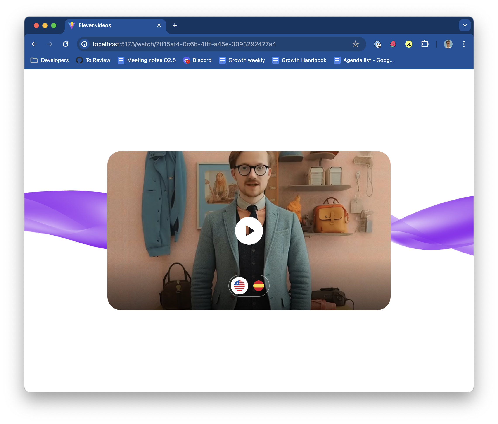

# ElevenVideos Example

This is an end to end example of using the ElevenLabs dubbing API to create "ElevenVideos" a simple site that lets you dub a video.



## Prerequisites

- Python
- NodeJS

## Setup Backend

Inside `backend` folder:

### Install Required Packages

```
pip install -r requirements.txt
```

### Setup Env Variables

Copy `.env.example` to `.env` and fill `ELEVENLABS_API_KEY` with your API key.

## Setup Frontend

Inside `frontend` folder:

### Install Required Packages

```
npm install
```

### Setup Env Variables

Copy `.env.example` to `.env`

## Running Program

Inside `backend` folder, run:

```
python3 app.py
```

To startup the backend server.

Inside `frontend` folder, run:

```
npm run dev
```

To start the frontend server.

## How to Create Dubbing Project

1. On `http://localhost:5173`, click `Add Project` button
2. Fill the required form. The video file should be in mp4 format.
3. Wait for the dubbing process to be finished.
4. Click language logo on target language to stream the video.
